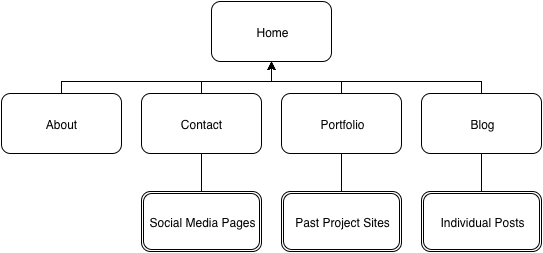

### What are the 6 Phases of Web Design?

1. **Information Gathering** - Deciding the purpose, goals, target audience, and type of content your site will have.
2. **Planning** - Making a sitemap to create an organizational tree for the site; deciding which technologies to use to build the site
3. **Design** - prototypes, mockups, communication between designer and coder
4. **Development** - transform the visual elements into a functioning website, focusing on front-end/back-end agreement 
5. **Testing and Delivery** - final details and complete functionality, validate code, SEO, browser tests, UX tests, hosting/publishing
6. **Maintenance** - address issues/problems, add new features and products, site backups, upgrades

### What is your site's primary goal or purpose? What kind of content will your site feature?

My site's goal is to display my website building skills and also to showcase my efforts in coding and design. It will feature a technical blog, links to social media including GitHub, info about me, and links to past work. 

### What is your target audience's interests and how do you see your site addressing them?

The target audience will be potential employers, colleagues, and anyone interested in or learning web technology. The site will address the employers via resume and portfolio links, colleagues via social media and GitHub, and curious learners via the technical blog. 

### What is the primary "action" the user should take when coming to your site? Do you want them to search for information, contact you, or see your portfolio? It's ok to have several actions at once, or different actions for different kinds of visitors.

They should view the portfolio and read some blog posts to see what my general field of experience and expertise is. They can then progress to choosing to collaborate with me on one of my GitHub repos, or they can contact me for any other purpose, such as pursuing a professional relationship. 

### What are the main things someone should know about design and user experience?

User experience is an often overlooked component to overall great website development. It focuses not only on the usability of a site's design and interactivity, but also on the emotional experience of the user. Is the user frustrated? Relaxed? Entertained? Inspired? It's important to assess the reactions of your target audience in order to make sure that the delivered product is achieving its intended purpose. 

Also, it's important to remember that design is not limited to the visual "look" of the website or app. Design has to do with every other organizational decision, too, including interactivity, syntactical color/movement/size cues, navigational flow, how many elements are present on the page, and where those elements are placed. 

### What is user experience design and why is it valuable? 

User experience design is the practice of incorporating the user's emotional response to your site from the beginning. Keeping in mind that your site will end up being used by real humans within and without your target audience helps you to stay focused on what *they* will value, rather than what you and your team may think is cool or valuable. Focusing early on user experience will fundamentally inform the entire design process and will result in a site that is highly engaging for and well-regarded by its users. 

### Which parts of the challenge did you find tedious?

It was tedious to create the sitemap, only because I was using a new tool and needed to quickly learn its interface. But I soon discoverd the tricks I needed, and it became rather breezy after that. This was, overall, another enjoyable exercise, giving me valuable ideas about possible web development workflow and the tools that facilitate it. 

