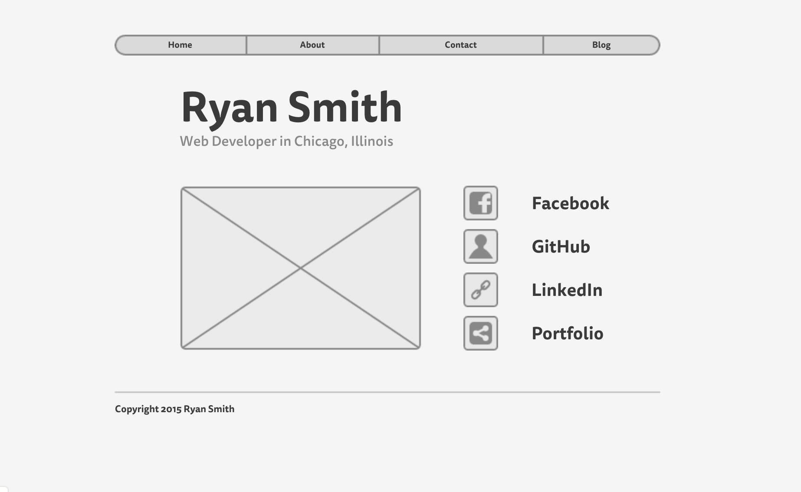
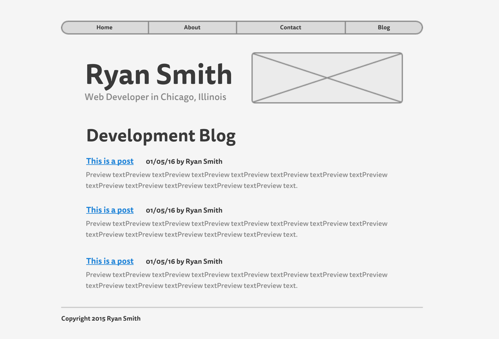

###What is a wireframe?

A wireframe is a rough draft of the final layout and look of a web page. It doesn't include typeface and color decisions, and graphics are not shown in any detail. It merely charts out the major sections and visual organization of the page elements. 

###What are the benefits of wireframing?

Wireframing provides a very quick way to communicate design planning decisions to a client or a team, or simply to create a reference point for yourself. It allows us to think in broad terms about the functionality and organization of the site without getting stuck in details about color and shape and typeface. Those fine-grained decisions should come later, and at this stage, the goal is merely to establish a general sense of usability and organizational clarity. 

###Did you enjoy wireframing your site?

I was surprised how quickly I was able to sketch out a basic layout using Mockingbird. I can see how using such a tool helps a team iterate quickly when deciding how a site's layout should be organized. 

###Did you revise your wireframe or stick with your first idea?

At first, I didn't include a navigation bar and footer, but then I added them afterward when I realized that the site would be expanding in future challenges, and the user will need those interactivity cues. I also adjusted the spacing and sizing of the elements, ultimately opting for a wider nav bar and footer, with some narrower content in between. 

###What questions did you ask during this challenge? What resources did you find to help you answer them?

I had forgotten how to include inline images using Markdown syntax, so I consulted [Markdown Syntax Documentation](https://daringfireball.net/projects/markdown/syntax#img), and now I am an image pro 

###Which parts of the challenge did you enjoy and which parts did you find tedious?

I didn't think anything was tedious in this challenge. I really enjoy doing all of this stuff quite a bit. It's cool to see how quickly I can do the git branch/push/pull/merge/etc workflow now, and I'm enjoying learning about these cool free online tools, like Mockingbird and other free wireframers. 