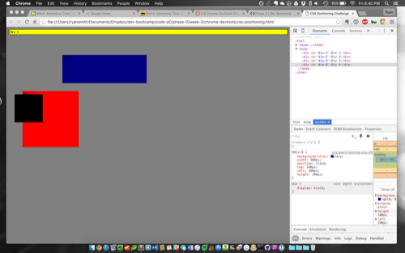
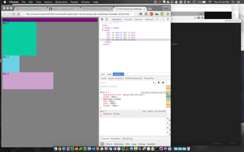
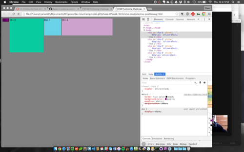
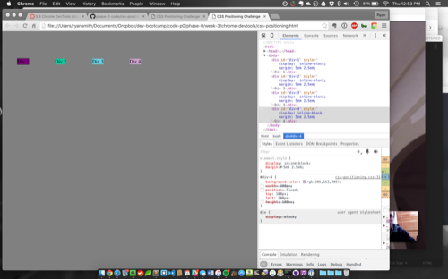
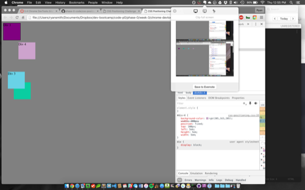
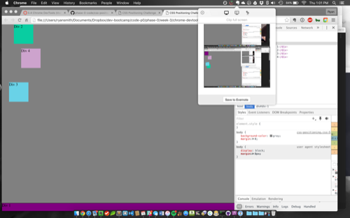
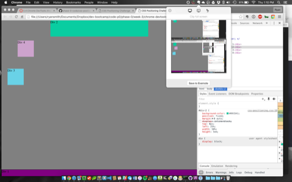
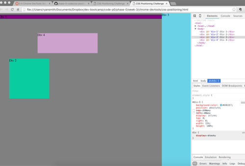
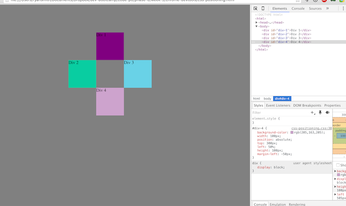

### How can you use Chrome's DevTools inspector to help you format or position elements?

Using the inspector, one is able to view the html structure and its associated CSS style rules side-by-side with the actual, rendered web page. You can select any element from the DOM and try out any values and view the results in real time. This is especially useful if you aren't sure which size or value you would like something to be and need to quickly test several different values before choosing. Without the immediate feedback that the inspector provides, the alternative workflow would be the much slower process of repeatedly updating the actual CSS file, saving it, and refreshing the browser. 

### How can you resize elements on the DOM using CSS?

Resizing elements can be done in different ways. If the element is an inline text element, the size would be controlled mostly with font-size, line-height, and letter-spacing. Block elements, on the other hand, have dimensions dictated by the "box model" paradigm, so they can be resized directly using the height and width properties, and their size can also be influenced indirectly by other properties like padding and parent width. Both inline and block elements can be influenced if they have any relative relationships either through inheritance from parent elements' styles or by being sized with relative values (% or em or vh, for example, instead of px). 

### What are the differences between absolute, fixed, static, and relative positioning? Which did you find easiest to use? Which was most difficult?

Static positioning is where a block element would appear by following its default place in the document flow. It would have its own line and appear below other static elements. In essence, static positioning is really a lack of positioning altogether. Relative positioning will use the default static position as its origin and move relative to that location. For example, if relatively positioned, a div with a "top" value of 5px will move 5px down from where it would have appeared if it hadn't been positioned (i.e. static). Absolute positioning calculates an element's top, left, bottom, and right values relative to the edges of the nearest positioned parent element. If no parents are positioned, these values will be relative to the body element itself. Fixed positioning is similar to absolute, but its values are always relative to the viewport (the visible window holding the web content, excluding anything that is scrolled out of view). Fixed elements will remain 'fixed' in their position regardless of scrolling or movement of any other page elements. I felt that absolute and fixed positioning was the easiest to use because it provided a consistent plane or grid of points within the viewport or document. Static positioning can still be a little unpredictable and can change depending on surrounding content, and relative positioning can also be variable due to different calculated original, static values across different browsers. 

### What are the differences between margin, border, and padding?

In the box model, a block element has its own height and width dimensions, but surrounding the actual content is a border. Even if the border is set at 0px width (invisible), there is still an invisible horizon separating "inside" the element from "outside". Padding is the inner space between the border and the element's content, and margin is the outer space between the border and any other neighboring elements on the page. If one element has a right margin of 5px, and an element on its right has a left margin of 5px, the space between the two elements will be the combined length of the two margins, 10px. 

### What was your impression of this challenge overall? (love, hate, and why?)

I have had experience with a lot of CSS in the past, and I've always enjoyed using the inspector in Chrome's Devtools. It's so much easier to adjust values and see the page respond in real time than to do the endless file changes, saves, and browser refreshes. Playing with CSS has always been very enjoyable for me because it takes the nebulous concept of visual harmony and exposes it as the sum of many text-based rules. CSS helps you gain a logical understanding of what pleases your eye, and why, since it gives names and values to everything you see. Also, it's incredibly fun to be working with other humans, which is what I really was looking forward to with DBC since my experience with web development until now has been solitary computer work. I loved adjusting the CSS with my pair and having a discussion about the different possibilities. In this particular case, my pair came up with a different strategy for recreating one of the challenge layouts than I did, and it was educational to see how his alternate strategy still produced a correct result. 

### The challenge screenshots:

