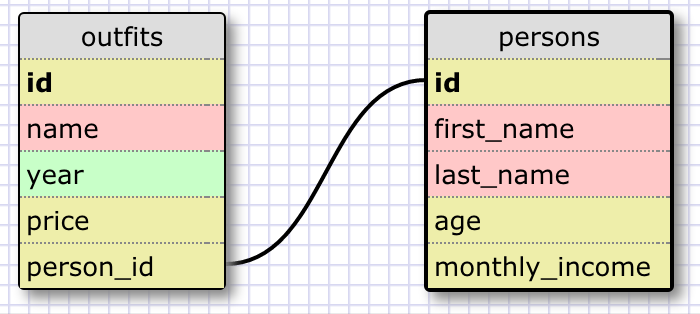

#### What are databases for?

Databases are digital entities meant for storage of information/data that can be queried, updated, altered, and filtered depending on the use case. They can be used to organize related information into 2-D, human readable table structure.

#### What is a one-to-many relationship?

A one-to-many relationship is when you have two sets of data, and each of the records in one of them belong to one of the "groups" defined in the other. Otherwise stated, it is a relationship of one "group" with many members of that group. An example would be a table that contains records/rows for individual novels and another table that lists novel genres. Each novel will belong to one of the genres (in this simple example), and conversely, each genre will have many novels that belong to it. 

#### What is a primary key? What is a foreign key? How can you determine which is which?

A primary key is a unique identifier that belongs to each record in the table. It must be unique because it identifies only one individual record. An example is just an auto-incrementing id for each row, or alternatively, it can be another unique id like a social security number or driver's license number. A foreign key is an id that references the unique id for a related row in a separate, related table. Using the example above, the foreign key in the novels table would be a genre id, which would reference the unique id in for the appropriate genre listed in the genre table. The primary key is likely to be the first columnn in the database, and the foreign key will likely be named someothertable_id, like category_id or genre_id.

#### How can you select information out of a SQL database? What are some general guidelines for that?

You can use the SQL SELECT clause, and you can filter using the FROM and WHERE clauses. You can also explore related tables using JOIN. You can also use calculations like AVG(), MIN(), and MAX(). 

#### Example "outfits" schema

