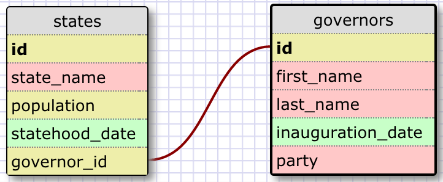
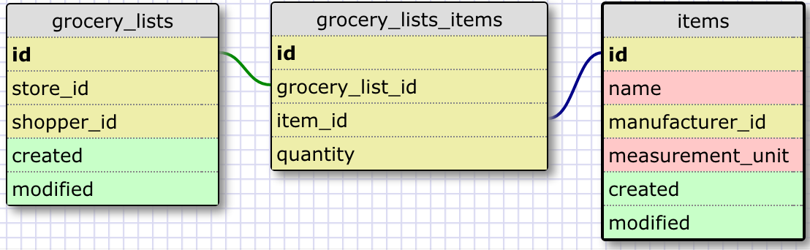

#### Release 2: One-to-One Relationship

The relationship between states and governors is one-to-one because each state has only one governor, and each governor governs only one state. The database could be expanded with a third table that had information about the different political parties, and a one-to-many relationship would exist between the parties and their respective governors. A one-to-one relationship, therefore, is present whenever both entities are connected to just one instance of the other. 

#### Release 3: Many-to-Many Relationship

The relationship between grocery lists and items on that list is many-to-many because grocery lists have many items, and each item can appear on many grocery lists. The join table records the presence of each item placed on a particular list, and I figured this was the appropriate table on which to include a quantity the shopper wishes to buy. Further tables could be added to this schema: stores, manufacturers, and shoppers. Items and stores could have another many-to-many relationship since stores have many items and items can be found in multiple stores. This would require another join table called stores_items, which might include some data on quantity in stock and aisle location. 

#### What is confusing about database schemas? What makes sense?

I found the information regarding database schemas straightforward; they are simple ways to model real-life relationships on a two-dimensional plane. To relate this to programming classes, which also represent groups of real-world objects, the table is like the class definition, the columns are like the instance variables / attributes, and the rows are the separate instances of the class, each having its own values for the instance-variable attributes. The "class methods" would be the queries written in SQL, in this analogy. 